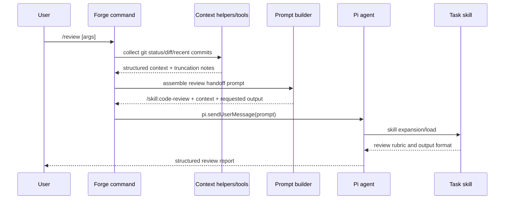
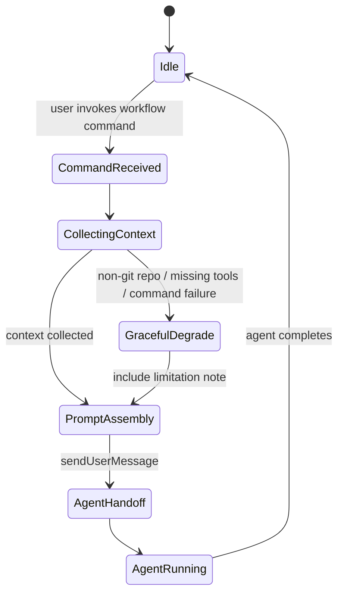

# Spec: Re-architect pi-forge as a Workflow-Oriented Pi Extension

## Executive Summary

`pi-forge` should move from a prompt-and-skill bundle into a real workflow extension. Roles will remain session-long stance/persona, skills will become task-focused capability packages, and Pi extension commands/tools will orchestrate context gathering, workflow kickoff, and user-facing development flows.

This is a breaking redesign. Because the extension is currently personal-use only, old persona-style skill names such as `auditor`, `reviewer`, and `planner` will be hard-renamed rather than kept as compatibility aliases.

## Goal

Rework `pi-forge` so that:

1. **Roles define who the assistant is for the session** — currently `tech-lead`, `architect`, and `none`.
2. **Skills define what/how to do a task** — security audit, code review, database patterns, testing workflow, etc.
3. **Commands define user-facing workflows** — `/review`, `/security`, `/test`, `/debug`, `/spec`, `/commit`, and later domain-specific commands.
4. **Custom tools and command helpers provide deterministic context** — git diffs, repo maps, dependency inventory, test summaries, and other structured context that should not depend on ad hoc shell exploration.

The target experience is that the user types a workflow command, Forge gathers relevant context, chooses or invokes the right task skill, and starts the agent with a high-quality prompt that includes concrete project state.

## Context

### Current repo structure

Current tracked files are centered around:

```text
src/index.ts
src/roles.ts
src/prompts/tech-lead.md
src/prompts/architect.md
src/skills/*/SKILL.md
tests/smoke.sh
README.md
package.json
```

`src/index.ts` currently owns most extension behavior directly:

- registers `--role`
- contributes `src/skills` through `resources_discover`
- restores role state on `session_start`
- injects the active role prompt in `before_agent_start`
- registers `/role`
- registers `/forge`

This is appropriate for a small role extension, but it will not scale cleanly once Forge has many commands, workflow helpers, custom tools, and smoke-test surfaces.

### Current roles

`src/roles.ts` defines:

| Role | Purpose |
|---|---|
| `tech-lead` | Default general-purpose implementation/coordinator role |
| `architect` | Design-only architecture role |
| `none` | Reset to Pi default behavior |

This layer is conceptually sound and should remain small.

### Current skill issue

Several current skills are named and written as specialist personas:

| Current skill | Problem |
|---|---|
| `auditor` | Persona name; mixes security-audit workflow with “you are an auditor” identity |
| `reviewer` | Persona name; should be a code-review rubric/workflow |
| `planner` | Persona name; should be work-planning/task-decomposition workflow |
| `tester` | Persona-ish; should be testing workflow or test strategy/execution |
| `backend`, `frontend`, `db`, `devops`, `docs` | Domain labels; mostly acceptable, but clearer as capability/pattern packages |

Pi skills are loaded progressively as capability packages. They should contain workflows, checklists, templates, reference docs, and task constraints — not pretend to be separate session-long agents.

### Pi extension capabilities relevant to this redesign

Pi extensions support the primitives Forge should use:

| Capability | Forge use |
|---|---|
| `registerCommand()` | User-facing workflows such as `/review` and `/security` |
| `sendUserMessage()` | Commands can synthesize a high-quality prompt and hand off to the agent |
| `registerTool()` | Deterministic reusable context gatherers callable by the LLM |
| `pi.exec()` | Command/helper-owned safe shell calls for git and project inspection |
| `resources_discover` | Continue contributing skill paths |
| `before_agent_start` | Continue injecting active role prompt |
| `appendEntry()` | Persist Forge state such as active role and later workflow metadata |
| `setStatus()` / widgets | Show active role and later active workflow/progress |
| `ctx.ui.select/input/confirm` | Interactive workflow choices in non-print modes |
| `ctx.hasUI` | Commands must degrade gracefully in print/JSON modes |
| subagent example pattern | Future isolated reviewer/security/planner passes, not MVP |

## Non-Goals

This spec intentionally does **not** include:

1. **No global permission/safety gate.** Previous Forge direction removed extension-level bash/edit confirmation. This redesign must not reintroduce broad global guards.
2. **No automatic Terraform/OpenTofu/Terragrunt state mutation.** DevOps workflows may provide clearly labeled human-run commands with safety checks, but Forge must not execute state-altering Terraform commands.
3. **No automatic cloud write operations.** Cloud CLI write operations require explicit human confirmation if future dedicated cloud tools are added. Initial workflows should avoid executing cloud writes.
4. **No subagents in the MVP.** Subagents are promising but add subprocess complexity, model/tool configuration questions, and output rendering work. Introduce them after command/tool workflows prove valuable.
5. **No compatibility aliases for old skill names.** The migration is intentionally breaking.

## Proposed Architecture

### Layering model

```mermaid
flowchart TD
  User[User] --> Role[/role command]
  User --> Workflow[Workflow commands]
  User --> DirectSkill[/skill:task-skill]

  Role --> RoleState[Session role state]
  RoleState --> PromptInjection[before_agent_start role prompt injection]

  Workflow --> ContextGathering[Context gathering helpers/tools]
  ContextGathering --> PromptBuilder[Workflow prompt builder]
  PromptBuilder --> SendUserMessage[pi.sendUserMessage]
  SendUserMessage --> SkillInvocation[Explicit /skill:<task> invocation]
  DirectSkill --> SkillInvocation

  SkillInvocation --> Agent[Pi agent turn]
  PromptInjection --> Agent

  ContextGathering --> Git[git context]
  ContextGathering --> Repo[repo map]
  ContextGathering --> Dependencies[dependency inventory]
  ContextGathering --> Tests[test summary]
```

### Responsibility boundaries

| Layer | Owns | Must not own |
|---|---|---|
| Roles | Session-long behavior, tone, broad defaults | Domain-specific checklist depth |
| Skills | Task workflow, rubrics, templates, references | Session identity, command orchestration, context collection |
| Commands | Workflow entrypoints, user choices, prompt assembly, state labels | Deep domain rubrics duplicated from skills |
| Tools/helpers | Deterministic project context, structured outputs, safe truncation | Open-ended reasoning or persona behavior |
| Smoke tests | Manual validation of roles, skills, commands, constraints | Deterministic assertions on exact LLM prose |

### Command flow



### Workflow state machine



Commands should fail soft. If git is unavailable, the command should still hand off a useful prompt that says exactly what context could not be collected.

## Pattern & Technology Decisions

### Decision 1: Hard-rename persona skills into task skills

**Decision:** Rename skills immediately to task/capability names. Do not keep aliases.

| Current | Target |
|---|---|
| `auditor` | `security-audit` |
| `reviewer` | `code-review` |
| `planner` | `work-planning` |
| `tester` | `testing-workflow` |
| `spec` | `spec-writing` |
| `backend` | `backend-patterns` |
| `frontend` | `frontend-patterns` |
| `db` | `database-patterns` |
| `devops` | `infrastructure-workflows` |
| `docs` | `documentation` |
| `debugging-methodology` | `debugging-methodology` |
| `git-conventions` | `git-conventions` |
| `coding-guardrails` | `coding-guardrails` |

**Why:** Skills should answer “what workflow/capability should I apply?” not “which hidden agent am I pretending to be?”

**Consequences:**

- README and smoke tests must change in the same migration.
- Tech-lead and architect prompts must reference the new skill names.
- Existing local muscle memory for `/skill:auditor` etc. breaks, intentionally.

### Decision 2: Commands are workflow facades

**Decision:** Add Forge workflow commands that gather context and hand off to skills using `pi.sendUserMessage()`.

Initial command set:

| Command | Skill invoked | Primary context |
|---|---|---|
| `/review` | `code-review` | git status, diff, diff stat, recent commits |
| `/security` | `security-audit` | repo map, dependency manifests, auth/config/security-relevant file hints |
| `/test` | `testing-workflow` | test files, package scripts, recent failures if supplied |
| `/debug` | `debugging-methodology` | user symptom, recent changes, optional logs pasted by user |
| `/spec` | `spec-writing` | current repo context and requested feature/change |
| `/commit` | `git-conventions` | staged/unstaged diff, branch name, recent commits |

**Why:** OpenCode’s lost workflow surface area was primarily commands/subagents/dynamic context, not just skill prose. Pi commands are the correct surface for this.

**Consequences:**

- `src/index.ts` should be split; commands should not all live inline.
- Command smoke tests need temp git repos for realistic validation.
- Commands must work in print mode without interactive prompts.

### Decision 3: Context gathering starts as command-local helpers, then graduates to tools

**Decision:** For the first command (`/review`), use shared internal helpers rather than immediately exposing every helper as an LLM-callable tool. Promote helpers to custom tools when reuse by the model or rendering/state benefits are clear.

Recommended initial custom tool candidates after `/review` proves the pattern:

| Tool | Purpose | Exposed to LLM? | Phase |
|---|---|---:|---:|
| `forge_git_context` | Structured git status/diff/recent commits with truncation | Yes | Phase 1b |
| `forge_repo_map` | Repo structure, package managers, languages, scripts | Yes | Phase 2 |
| `forge_dependency_inventory` | Manifest/lockfile inventory without mutating installs | Maybe | Phase 2 |
| `forge_test_summary` | Test script discovery and optionally recent test output summarization | Maybe | Phase 3 |

**Why:** Commands can ship faster with plain helpers. Custom tools should be introduced when they provide durable value: structured arguments, custom rendering, reusable prompt guidance, truncation behavior, or LLM-controlled follow-up inspection.

**Consequences:**

- Avoids over-abstracting before the first workflow works.
- Leaves a clear path to richer Pi extension behavior.

### Decision 4: Subagents are deferred

**Decision:** Do not implement subagents in the first redesign. Revisit after `/review` and `/security` command workflows are working.

**Why:** Pi’s subagent example is powerful for isolated context windows and parallel passes, but it introduces subprocess execution, model/tool configuration, streaming output rendering, and security considerations around project-local agents.

**Future fit:**

- `/review --subagent` could run an isolated code-review pass.
- `/security --deep` could run scout → security-audit chain.
- `/spec --research` could run repo-scout before spec drafting.

### Decision 5: Preserve user preference against broad safety gates

**Decision:** Do not add global `tool_call` gates for bash/edit/write. Workflow-specific commands and tools should avoid dangerous operations by design.

**Why:** The extension previously removed extension-level safety guardrails by user request. Reintroducing them as part of the architecture redesign would violate that constraint.

**Boundary:** Dedicated future tools may enforce their own scope. Example: `forge_git_context` only reads git state and cannot mutate files. This is not a global safety gate; it is a safe tool contract.

## Directory / Structure Recommendations

Target structure:

```text
src/
  index.ts                         # thin extension entrypoint
  roles.ts                         # role definitions
  prompts/
    tech-lead.md
    architect.md

  extension/
    constants.ts                   # paths, custom entry types, shared names
    role-state.ts                  # active role restore/persist/status helpers
    register-roles.ts              # --role, /role, /forge, prompt injection
    register-resources.ts          # skills/prompts/themes contribution
    register-commands.ts           # wires workflow commands
    register-tools.ts              # wires custom tools when introduced

    workflows/
      review.ts                    # /review command
      security.ts                  # /security command
      test.ts                      # /test command
      debug.ts                     # /debug command
      spec.ts                      # /spec command
      commit.ts                    # /commit command

    context/
      git-context.ts               # status/diff/log helpers
      repo-map.ts                  # repo/package/language discovery
      dependency-inventory.ts      # manifest/lockfile inventory
      truncation.ts                # shared truncation notes/limits if needed

    prompt-builders/
      review-prompt.ts
      security-prompt.ts
      test-prompt.ts
      debug-prompt.ts
      spec-prompt.ts
      commit-prompt.ts

  skills/
    coding-guardrails/
    spec-writing/
    backend-patterns/
    frontend-patterns/
      reference/
    database-patterns/
    infrastructure-workflows/
      reference/
    documentation/
    debugging-methodology/
    git-conventions/
    code-review/
      reference/
    security-audit/
      reference/
    testing-workflow/
    work-planning/
```

`src/index.ts` should become an orchestration root only. Its job should be to call registration functions, not contain workflow logic.

## Command Specifications

### `/review`

**Purpose:** Review the current git diff with structured code-review behavior.

**Default behavior:**

- If inside a git repo:
  - collect branch name
  - collect `git status --short`
  - collect staged and unstaged diff summary
  - collect relevant full diff, truncated with explicit notes
  - collect recent commits for convention/context
- If not inside a git repo:
  - proceed with a prompt that asks the user to provide files/diff or clarify scope

**Arguments:**

| Arg | Meaning |
|---|---|
| empty | Review all current changes |
| `staged` | Review staged changes only |
| `unstaged` | Review unstaged changes only |
| `branch <base>` | Review changes since base ref, e.g. `branch main` |
| free text | Additional review focus, e.g. `focus on error handling` |

**Handoff prompt shape:**

- Invoke `/skill:code-review`
- Include collected git context
- Include explicit scope
- Ask for the standard review output format
- Ask not to modify code

**Validation:**

- In a temp git repo, create a base commit, modify a file, run `/review --print` smoke test.
- Confirm output includes review structure and references actual changed files.

### `/security`

**Purpose:** Start a security audit workflow with safe, bounded context.

**Default behavior:**

- Collect repo map and stack indicators.
- Identify likely auth/config/routing/dependency files by filename patterns.
- Do not read secret-bearing files.
- Do not run dependency audit commands in MVP unless explicitly added later with clear behavior.

**Handoff prompt shape:**

- Invoke `/skill:security-audit`
- Include discovered stack/context
- Include explicit note about secret-file avoidance
- Ask for findings only when backed by evidence

**Validation:**

- Smoke test with a small temp repo containing an insecure route file.
- Confirm the audit references file paths and exploit paths.

### `/test`

**Purpose:** Start test strategy, test writing, or test failure diagnosis workflow.

**Default behavior:**

- Detect package manager/test scripts from manifests.
- Identify test directories and naming patterns.
- If user pasted failure output, include it as primary evidence.
- Do not automatically run test suites in MVP.

**Handoff prompt shape:**

- Invoke `/skill:testing-workflow`
- Include detected test structure/scripts
- Ask for strategy, specific test plan, or failure diagnosis depending on args

### `/debug`

**Purpose:** Start a reproduction-first debugging workflow.

**Default behavior:**

- Ask for missing reproduction details if symptom is vague.
- Include recent git changes if in a repo.
- Include logs only when supplied by user or collected by explicit future tool.

**Handoff prompt shape:**

- Invoke `/skill:debugging-methodology`
- Emphasize reproduction gate and hypothesis testing

### `/spec`

**Purpose:** Start a context-grounded spec-writing workflow.

**Default behavior:**

- Include current repo structure at a shallow level.
- Include relevant files only when obvious from args or after the model asks.
- Use `/skill:spec-writing` for staged spec dialogue.

**Name collision note:** Extension command `/spec` is distinct from `/skill:spec-writing`. Extension commands are checked before skill expansion, which is acceptable because `/spec` is intended as the user-facing workflow.

### `/commit`

**Purpose:** Draft conventional commit messages and commit breakdowns from current changes.

**Default behavior:**

- Collect git status and diff summary.
- Produce one or more proposed Conventional Commit messages.
- Do not run `git add` or `git commit` automatically in MVP.

**Handoff prompt shape:**

- Invoke `/skill:git-conventions`
- Include status/diff summary
- Ask for commit message(s), split recommendations, and rationale

## Skill Refactor Specification

Each renamed skill should be rewritten so the top section describes a task workflow, not a persona.

Preferred skill shape:

```text
---
name: <task-name>
description: <what this capability does and when to use it>
---

# <Task Name>

Use this skill when...

## Mode Constraints
...

## Workflow
...

## Output Format
...

## Reference Material
...
```

Avoid opening with “You are a <specialist>.” A brief stance is acceptable only when it clarifies quality bar, not identity.

Examples:

| Bad | Better |
|---|---|
| “You are an application security engineer...” | “Use this workflow to perform evidence-backed application security assessment.” |
| “You’re a senior engineer with a reputation...” | “Use this rubric to review changed code for correctness, security, performance, maintainability, errors, and tests.” |
| “You’re a planner...” | “Use this workflow to decompose ambiguous or large work into ordered, time-boxed tasks.” |

## README / Documentation Changes

README should be reframed from “role-based development workflow” to “workflow-oriented Pi extension.”

Required README updates:

1. Explain the three-layer model: roles, skills, commands.
2. List renamed task skills.
3. Add command documentation for `/review` first, then additional commands as implemented.
4. Explain that old skill names were intentionally removed.
5. Keep install instructions unchanged.

## Testing & Validation

### Static validation

- Run TypeScript validation after structural changes.
- Run skill discovery:
  - `pi -e ~/dev/pi-forge --print "list the skill names you have available"`
- Confirm old names are absent and new names are present.

Expected new skill list:

```text
backend-patterns
code-review
coding-guardrails
database-patterns
debugging-methodology
documentation
frontend-patterns
git-conventions
infrastructure-workflows
security-audit
spec-writing
testing-workflow
work-planning
```

### Smoke-test changes

`tests/smoke.sh` should be updated in two waves:

1. **Rename wave**
   - Replace all `/skill:auditor` with `/skill:security-audit`.
   - Replace `/skill:reviewer` with `/skill:code-review`.
   - Replace `/skill:planner` with `/skill:work-planning`.
   - Replace other renamed skills accordingly.

2. **Command wave**
   - Add temp git repo setup helpers for command tests.
   - Add `/review` smoke scenario.
   - Later add `/security`, `/test`, `/debug`, `/spec`, `/commit` scenarios.

Smoke tests must continue running from temp directories and printing output for manual inspection.

### Manual interactive validation

- `/role` lists only `tech-lead`, `architect`, and `none`.
- `/forge` shows active role and prompt preview.
- `/review` in a real repo produces a review prompt/result using actual git context.
- `/review` outside a git repo degrades gracefully.
- `/reload` picks up edited prompts/skills and clears prompt cache.

## Failure Modes & Handling

| Failure | Handling |
|---|---|
| Not in a git repo | Command proceeds with limitation note and asks user for diff/scope |
| Git command fails | Include stderr summary; do not crash command |
| Diff too large | Truncate with explicit omitted byte/line counts and suggest narrower scope |
| Missing skill after rename | Smoke test should catch; command should notify clear error if handoff target is missing |
| Print mode has no UI | Use defaults; do not call blocking selects/confirms unless `ctx.hasUI` |
| Secret-bearing files detected | Do not read contents; include only path/name metadata when safe |
| User asks `/commit` to commit | MVP drafts commit message only; future auto-commit requires separate explicit design |
| Terraform state mutation appears in devops workflow | Do not execute; provide clearly labeled human-run guidance only |

## Migration Plan

### Phase 0 — Architecture correction: skills are tasks, not personas

1. Rename skill directories and frontmatter names according to the map in Decision 1.
2. Move reference folders with their renamed parent skills.
3. Rewrite persona openings into task/workflow openings.
4. Update `src/prompts/tech-lead.md` and `src/prompts/architect.md` skill references.
5. Update README skill table.
6. Update smoke tests for new skill names.
7. Validate skill discovery and smoke-test representative renamed skills.

### Phase 1 — Extension structure and `/review`

1. Split `src/index.ts` into registration modules without changing behavior.
2. Add shared git context helper.
3. Implement `/review` as the first workflow command.
4. Add smoke coverage using a temp git repo.
5. Update README command section.
6. Validate in print mode and interactive mode.

### Phase 2 — Core workflow command set

Implement, in order:

1. `/security`
2. `/test`
3. `/debug`
4. `/spec`
5. `/commit`

Each command should ship with:

- command documentation
- smoke test scenario
- graceful non-repo behavior
- print-mode behavior

### Phase 3 — Custom tools

Promote repeated helper logic into custom tools:

1. `forge_git_context`
2. `forge_repo_map`
3. `forge_dependency_inventory`
4. `forge_test_summary` if justified

Tool requirements:

- structured parameters
- output truncation
- details payload suitable for rendering/state later
- no mutating behavior unless separately designed and confirmed

### Phase 4 — UI and workflow polish

Add interactive affordances where they improve use:

- status indicator for active role and active workflow
- optional command argument completion
- `/forge` expanded workflow inventory
- widgets for long-running workflows if needed
- session labels/checkpoints for major workflow starts

### Phase 5 — Optional subagent workflows

After commands/tools prove useful, evaluate isolated subagent workflows:

- `/review --deep`
- `/security --deep`
- scout → plan → execute flows
- parallel frontend/security/review passes

Subagents require a separate spec before implementation.

## Trade-offs & Risks

### What this buys

- Clear separation between stance, capability, and workflow.
- Better use of Pi extension primitives.
- Restores OpenCode-style workflow surface area without recreating OpenCode’s agent model directly.
- Makes commands predictable and reusable.
- Keeps skills portable and aligned with the Agent Skills standard.

### What this costs

- Breaking skill names immediately.
- More extension code and module structure.
- More smoke-test maintenance.
- Some workflows need careful print-mode behavior because UI prompts are unavailable.

### Main risks

| Risk | Mitigation |
|---|---|
| Over-engineering before usage proves need | Start with `/review`; defer tools/subagents until repeated helper logic exists |
| Commands duplicate skill content | Commands only gather context and assemble handoff prompts; rubrics live in skills |
| Large diffs overwhelm context | Centralize truncation and include narrowing guidance |
| Skill rename misses references | Validate with skill discovery, README grep, smoke-test grep |
| Safety requirements become implicit | Keep non-goals and workflow boundaries explicit in README and devops skill |

## Open Questions

These do not block Phase 0 or Phase 1:

1. Should `/commit` eventually offer an interactive confirm-and-run commit flow, or remain message-only permanently?
2. Should dependency audit commands be run automatically in `/security`, or only suggested/human-run?
3. Which workflow helpers deserve custom rendering versus plain text output?
4. Should Forge expose project-local workflow configuration later, e.g. `.pi/forge.json`, or stay convention-based?
5. Should subagents use bundled Forge agent definitions or derive behavior from task skills?

## Task Checklist

### Phase 0 checklist

- [ ] Rename `src/skills/auditor` to `src/skills/security-audit` and update frontmatter.
- [ ] Rename `src/skills/reviewer` to `src/skills/code-review` and update frontmatter.
- [ ] Rename `src/skills/planner` to `src/skills/work-planning` and update frontmatter.
- [ ] Rename `src/skills/tester` to `src/skills/testing-workflow` and update frontmatter.
- [ ] Rename `src/skills/spec` to `src/skills/spec-writing` and update frontmatter.
- [ ] Rename `src/skills/backend` to `src/skills/backend-patterns` and update frontmatter.
- [ ] Rename `src/skills/frontend` to `src/skills/frontend-patterns` and update frontmatter.
- [ ] Rename `src/skills/db` to `src/skills/database-patterns` and update frontmatter.
- [ ] Rename `src/skills/devops` to `src/skills/infrastructure-workflows` and update frontmatter.
- [ ] Rename `src/skills/docs` to `src/skills/documentation` and update frontmatter.
- [ ] Rewrite renamed skill openings from persona framing to task/workflow framing.
- [ ] Update all skill references in role prompts.
- [ ] Update README skill table and direct-invocation examples.
- [ ] Update smoke tests to use new skill names.
- [ ] Validate skill discovery shows new names and not old names.

### Phase 1 checklist

- [ ] Create `src/extension/` structure.
- [ ] Move role state, role commands, and prompt injection out of `src/index.ts`.
- [ ] Keep `src/index.ts` as a thin registration root.
- [ ] Add git context helper for status, diff, diff stat, branch, and recent commits.
- [ ] Add `/review` command.
- [ ] Add `/review` smoke test using a temp git repo.
- [ ] Update README command documentation.
- [ ] Validate `/review` in a real repo, a temp repo, and a non-git directory.

### Phase 2 checklist

- [ ] Add `/security` command.
- [ ] Add `/test` command.
- [ ] Add `/debug` command.
- [ ] Add `/spec` command.
- [ ] Add `/commit` command.
- [ ] Add smoke coverage for each command.

### Phase 3+ checklist

- [ ] Promote git context helper to `forge_git_context` custom tool if useful after `/review`.
- [ ] Add `forge_repo_map` custom tool.
- [ ] Add dependency inventory helper/tool if `/security` repeats enough logic.
- [ ] Add UI/status polish.
- [ ] Write separate spec for subagent workflows before implementing them.
