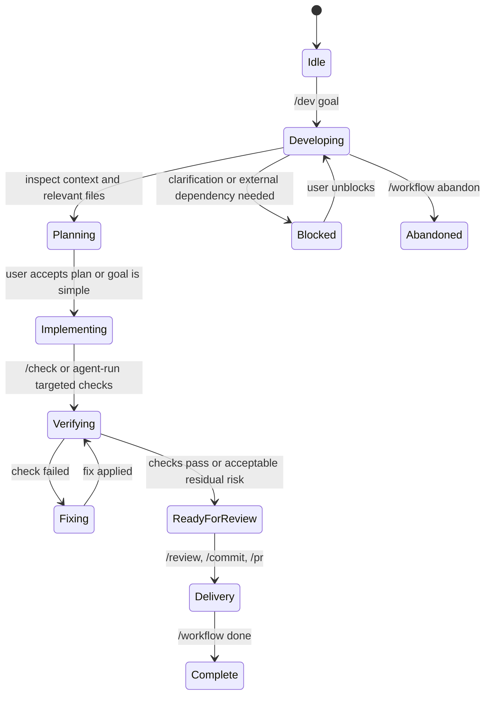

# Spec: Development Lifecycle Forge Workflows

## Summary

Extend `pi-forge` from workflow handoff commands into a full development lifecycle layer for competent full-stack developers. Forge should help a developer move from intent to implementation to verification to delivery while keeping the user in control and preserving Pi's normal tool visibility.

This spec defines the full end-state and phases implementation deliberately. It builds on, but does not replace:

- `docs/specs/2026-05-20-workflow-oriented-pi-forge.md` — command/tool/skill architecture.
- `docs/specs/2026-05-21-deep-workflow-modes.md` — `/review --deep` and `/security --deep`.

Containerized execution and sandboxing are intentionally out of scope.

## Goal

Forge should become a lifecycle cockpit with four connected capabilities:

1. **Guided development** — `/dev [goal]` starts an end-to-end development lane: understand, plan, implement, verify, and prepare delivery.
2. **Workflow state** — `/workflow` exposes and manages the active goal, plan, decisions, files, checks, risks, and next steps.
3. **Verification loop** — `/check`, `/verify`, and `/fix-tests` discover and run safe project checks, summarize results, and feed failures back into the workflow.
4. **Environment awareness** — `forge_environment_context` provides deterministic project metadata about runtimes, package managers, scripts, frameworks, CI, Docker, database/migration hints, and delivery surfaces.

Target experience:

```text
/dev add password reset flow
```

Forge should collect project context, create visible workflow state, ask only necessary clarifying questions, guide incremental implementation, run targeted checks, track verification, and end with a commit/PR-ready summary.

## Non-Goals

- No containerized Pi runtime or sandboxing.
- No autonomous background agent or hidden edit loop.
- No automatic dependency installation.
- No automatic deploys, cloud writes, database migrations, or Terraform/OpenTofu state mutations.
- No subagents in the initial implementation.
- No new monolithic `full-stack-dev` skill; lifecycle workflows compose existing skills.
- No replacement for existing `/spec`, `/debug`, `/test`, `/review`, `/security`, `/commit`, `/pr`, `/standup`, or `/repo-changes`.

## Context

Current Forge already has:

- Commands: `/spec`, `/debug`, `/test`, `/review`, `/security`, `/commit`, `/pr`, `/standup`, `/repo-changes`, `/forge`.
- Tools: `forge_git_context`, `forge_repo_map`, `forge_read_file`, `forge_dependency_inventory`, `forge_test_summary`.
- Context collectors under `src/extension/context/` for git, repo map, dependency inventory, test summary, safe file reads, and repository root resolution.
- Prompt builders under `src/extension/prompt-builders/`.
- Workflow command modules under `src/extension/workflows/`.
- Task skills for guardrails, backend/frontend/database/infrastructure patterns, debugging, testing, review, security, docs, git, specs, and planning.

The missing layer is continuity. Existing commands are effective entrypoints, but they mostly collect context and send a prompt. They do not maintain an active goal, track plan progress, remember which checks were run, or offer a single development lane across implementation and delivery.

## End-State Design

### User-facing command surface

| Command | Purpose |
|---|---|
| `/dev [goal]` | Start or resume a guided development workflow. |
| `/workflow` | Show active workflow state. |
| `/workflow update` | Ask the agent to refresh workflow state from current session/repo context. |
| `/workflow done` | Mark active workflow complete. |
| `/workflow abandon` | Mark active workflow abandoned. |
| `/workflow clear` | Clear active workflow UI state without deleting session history. |
| `/check [target]` | Select and run conservative non-destructive project checks. |
| `/verify [scope]` | Decide whether the active work is ready, using recent checks and optional fresh checks. |
| `/fix-tests [failure]` | Start a focused test/debug workflow for failing checks or pasted failure output. |

Existing delivery commands remain the handoff path:

- `/review` or `/review --deep` before merge.
- `/security` or `/security --deep` for sensitive changes.
- `/commit` for Conventional Commit creation.
- `/pr` for PR title/body.
- `/repo-changes` and `/standup` for release/status communication.

### Lifecycle flow



### `/dev [goal]`

`/dev` is the primary lifecycle entrypoint. It should not blindly start editing. It should collect enough deterministic context to guide the model, create visible workflow state, and hand off to the agent with clear expectations.

Behavior:

1. Resolve repository root.
2. Collect:
   - environment context,
   - repo map,
   - dependency inventory,
   - test summary,
   - git context.
3. Create a new workflow state entry unless an active workflow already exists.
4. If an active workflow exists, ask whether to resume, replace, or abandon it in UI mode; in non-UI mode, create a new state entry and note the previous active workflow.
5. Send a prompt that invokes `coding-guardrails` and instructs the agent to load domain skills only when needed.
6. Require the agent to inspect relevant files before editing.
7. Require a short plan before non-trivial edits.
8. Require targeted verification before delivery summary.

Prompt requirements:

- Include the user's goal verbatim.
- Include collected context in clearly labeled sections.
- State that state is advisory and the repo is source of truth.
- Direct the agent to ask one clarifying question if requirements are ambiguous.
- Direct the agent to route to `/spec` for design-heavy work.
- Direct the agent to avoid broad refactors unless required.
- End with expected output: plan, actions, verification, summary, risks, next suggested command.

### Workflow state

Workflow state is persisted through custom session entries and restored on `session_start`. It is visible and editable through commands. It is not injected into every model call automatically unless a workflow command chooses to include it.

State entry custom type:

```text
forge.workflow_state
```

Type shape:

```ts
type WorkflowKind = "dev" | "debug" | "test" | "review" | "security" | "release";
type WorkflowStatus = "active" | "planning" | "implementing" | "blocked" | "verifying" | "ready-for-review" | "complete" | "abandoned";
type StepStatus = "todo" | "doing" | "done" | "blocked" | "skipped";
type CheckStatus = "passed" | "failed" | "skipped" | "cancelled";

interface ForgeWorkflowState {
  schemaVersion: 1;
  id: string;
  kind: WorkflowKind;
  status: WorkflowStatus;
  goal: string;
  createdAt: number;
  updatedAt: number;
  repoRoot: string;
  branch?: string;
  plan: Array<{ id: string; text: string; status: StepStatus }>;
  decisions: Array<{ text: string; timestamp: number }>;
  filesTouched: string[];
  checksRun: Array<{
    command: string;
    cwd: string;
    status: CheckStatus;
    exitCode?: number;
    durationMs?: number;
    summary?: string;
    timestamp: number;
  }>;
  risks: string[];
  nextSteps: string[];
  previousWorkflowId?: string;
}
```

State rules:

- Append-only entries are the persistence mechanism; the latest non-terminal state for the current session is active.
- Terminal statuses are `complete` and `abandoned`.
- State can drift; `/workflow update` exists to reconcile it.
- Commands may append updated state entries. They should not rewrite old entries.
- Files touched can be derived from git status where possible rather than trusting model prose.

UI behavior:

- Footer status: compact active workflow indicator, e.g. `⚒ dev: password reset`.
- `/workflow`: full state display.
- Optional widget later: plan checklist and recent check status.

### `/workflow` commands

`/workflow` with no args displays:

- workflow id and status,
- goal,
- branch/repo root,
- plan checklist,
- recent decisions,
- files touched,
- checks run,
- risks,
- next steps.

Subcommands:

| Subcommand | Behavior |
|---|---|
| `update` | Sends a prompt asking the agent to refresh state from current repo/session context. |
| `done` | Appends state with `status: complete`. |
| `abandon` | Appends state with `status: abandoned`. |
| `clear` | Clears UI status/widget for the active workflow; does not delete history. |

MVP can avoid complex manual editing. If state correction is needed, the user can run `/workflow update` with instructions.

### Environment context

Add `src/extension/context/environment-context.ts` and register tool `forge_environment_context`.

Purpose: provide deterministic project metadata without installing packages, reading secrets, or running project code.

Type shape:

```ts
interface EnvironmentContext {
  root: string;
  packageManagers: string[];
  languages: string[];
  runtimes: Array<{ name: string; version?: string; source?: string }>;
  frameworks: Array<{ name: string; evidence: string[] }>;
  scripts: Array<{ manifest: string; name: string; command: string; category: "test" | "lint" | "typecheck" | "build" | "dev" | "format" | "other" }>;
  checkCommands: Array<{ label: string; command: string; cwd: string; confidence: "high" | "medium" | "low"; reason: string }>;
  ciFiles: string[];
  dockerFiles: string[];
  migrationHints: string[];
  deploymentHints: string[];
  monorepoHints: string[];
  truncated: boolean;
  errors: string[];
}
```

Detection should reuse `collectDependencyInventory()` where possible.

Signals:

| Area | Signals |
|---|---|
| Node | `package.json`, lockfiles, `engines`, scripts, known dependencies. |
| TypeScript | `tsconfig*.json`, `typescript` dependency, `.ts/.tsx` source files. |
| Python | `pyproject.toml`, `requirements.txt`, `uv.lock`, `poetry.lock`, `pytest` config. |
| Go | `go.mod`, `_test.go` files. |
| Rust | `Cargo.toml`, `Cargo.lock`. |
| Ruby | `Gemfile`, `Gemfile.lock`, Rails deps/dirs. |
| JVM | `pom.xml`, `build.gradle*`. |
| Frontend frameworks | `next`, `react`, `vue`, `svelte`, `vite`, Angular package names/configs. |
| Backend frameworks | `express`, `fastify`, `nestjs`, `django`, `flask`, `rails`, `spring`. |
| CI | `.github/workflows/*`, `.gitlab-ci.yml`, `circle.yml`. |
| Docker | `Dockerfile*`, `docker-compose*.yml`, `.dockerignore`. |
| DB/migrations | `prisma/`, `migrations/`, `db/migrate/`, `alembic/`, `knexfile`, `drizzle.config.*`. |
| Deploy | `vercel.json`, `netlify.toml`, `fly.toml`, `render.yaml`, Helm/Terraform/Terragrunt files by path only. |
| Monorepo | `pnpm-workspace.yaml`, `turbo.json`, `nx.json`, `lerna.json`, npm/yarn workspaces. |

### Check selection

`/check [target]` chooses safe commands from environment context.

Safety rules:

- Only run commands derived from explicit project scripts or known toolchain conventions.
- Never run install, deploy, publish, migration, seed, prune, clean, or cloud commands automatically.
- Never run scripts containing obvious destructive tokens such as `rm -rf`, `terraform apply`, `kubectl apply`, `docker compose down -v`, `dropdb`, or `prisma migrate deploy`.
- Use timeouts and output truncation.
- Prefer narrower checks when `target` is supplied.
- In UI mode, confirm before broad checks such as full `build` in a large project or multiple commands.
- In non-UI mode, print the proposed command and skip if confidence is not high.

Command preference order:

1. Target-specific test command when the target maps to a known framework.
2. `typecheck` / `tsc --noEmit` for TypeScript changes.
3. `test` script for test-related targets.
4. `lint` or `check` scripts.
5. `build` only when explicitly requested or when no safer validation exists.

Result shape:

```ts
interface CheckResult {
  command: string;
  cwd: string;
  exitCode: number;
  durationMs: number;
  stdout: string;
  stderr: string;
  truncated: boolean;
  summary: string;
}
```

`/check` should append the result to workflow state when a workflow is active.

### `/verify [scope]`

`/verify` answers: "Is this work ready?"

Behavior:

1. Load active workflow state if present.
2. Collect git context and environment context.
3. If recent relevant check results exist, include them.
4. If no recent checks exist, ask to run `/check` in UI mode or propose the command in non-UI mode.
5. Send a verification prompt that asks the agent to assess readiness.

Output expected from the agent:

- readiness: ready / not ready / ready with caveats,
- checks considered,
- files changed,
- risks,
- required follow-ups,
- suggested next command (`/review`, `/security`, `/commit`, `/pr`, or more implementation).

### `/fix-tests [failure]`

`/fix-tests` starts a focused workflow for test failures. It complements `/debug` and `/test fix` by incorporating recent check output and active workflow state.

Behavior:

1. If `failure` arg is provided, include it verbatim.
2. Otherwise use the most recent failed check from active workflow state.
3. Collect test summary, environment context, and git context.
4. Send a prompt invoking `testing-workflow` and `debugging-methodology`.
5. Require reproduction before edits and targeted re-run after fixes.

### Composition with existing workflows

| Existing command | Relationship |
|---|---|
| `/spec` | `/dev` should route here when requirements/design are too ambiguous for implementation. |
| `/debug` | `/fix-tests` and `/dev fix ...` can reuse debugging methodology. |
| `/test` | Remains strategy/planning; `/check` performs selected execution. |
| `/review --deep` | Recommended once `/verify` says ready for review. |
| `/security --deep` | Recommended for auth, secrets, permissions, data exposure, dependency, or deployment changes. |
| `/commit` | Uses git context after verification. |
| `/pr` | Uses branch diff after commit or before PR preparation. |

## Design Decisions

### Decision 1: Full end-state spec, phased delivery

**Decision:** Define the complete lifecycle experience now but implement it in phases.

**Why:** State shape, command boundaries, and environment context are foundational. Designing them together prevents later features from feeling bolted on.

### Decision 2: Compose existing skills

**Decision:** `/dev` invokes `coding-guardrails` and relies on the default Tech Lead stance plus domain skills.

**Why:** A broad `full-stack-dev` skill would duplicate existing skills and become vague.

### Decision 3: State is advisory and visible

**Decision:** Persist state as append-only custom entries and expose it through `/workflow` and UI status.

**Why:** Developers should be able to see, correct, complete, or abandon Forge's understanding of the work.

### Decision 4: `/check` is conservative by default

**Decision:** Run only safe, explicit, non-destructive checks. Ask or refuse when confidence is low.

**Why:** Trust beats automation breadth. A lifecycle tool that surprises the developer will not be used.

### Decision 5: Environment context is deterministic

**Decision:** Detect project capabilities from files, manifests, and scripts rather than model inference.

**Why:** This context drives command selection and prompts; predictable false negatives are safer than hallucinated positives.

## Implementation Plan

### Phase 1 — Environment context foundation

- [ ] Add `src/extension/context/environment-context.ts`.
- [ ] Reuse `collectDependencyInventory()` for manifest/package data.
- [ ] Detect package managers, languages, scripts, CI files, Docker files, migration hints, deployment hints, monorepo hints, and common frameworks.
- [ ] Add `forge_environment_context` to `register-tools.ts` with prompt snippet/guidelines.
- [ ] Add README tool documentation.
- [ ] Add unit tests for Node/TypeScript, Python, Go, and mixed/monorepo fixtures.

### Phase 2 — Check command selection and `/check`

- [ ] Add check-selection helper under `src/extension/workflows/checks.ts` or `src/extension/context/check-selection.ts`.
- [ ] Add `/check [target]` command module.
- [ ] Implement script safety classification.
- [ ] Implement command execution with timeout and output truncation.
- [ ] Show summary in UI and print JSON/text in non-UI mode.
- [ ] Add tests for safe/unsafe script classification and command selection.

### Phase 3 — Workflow state

- [ ] Add workflow state types/helpers under `src/extension/workflows/state.ts`.
- [ ] Restore latest active state on `session_start`.
- [ ] Add footer status for active workflow.
- [ ] Add `/workflow`, `/workflow done`, `/workflow abandon`, `/workflow clear`.
- [ ] Append check results to state when `/check` runs.
- [ ] Add state serialization/restoration tests.

### Phase 4 — `/dev`

- [ ] Add `src/extension/prompt-builders/dev-prompt.ts`.
- [ ] Add `/dev [goal]` command module.
- [ ] Collect environment, repo, dependency, test, and git context.
- [ ] Handle existing active workflow: resume/replace/abandon in UI mode; safe fallback in non-UI mode.
- [ ] Create workflow state with `kind: "dev"`.
- [ ] Send guided development handoff prompt.
- [ ] Add README documentation and smoke tests.

### Phase 5 — `/verify`

- [ ] Add `src/extension/prompt-builders/verify-prompt.ts`.
- [ ] Add `/verify [scope]` command.
- [ ] Include active workflow state, recent check results, git context, and environment context.
- [ ] Offer to run `/check` when no recent checks are available in UI mode.
- [ ] Update workflow status to `verifying` and then advisory `ready-for-review` only through explicit command result/state update.

### Phase 6 — `/fix-tests`

- [ ] Add `src/extension/prompt-builders/fix-tests-prompt.ts`.
- [ ] Add `/fix-tests [failure]` command.
- [ ] Pull most recent failed check when no failure text is provided.
- [ ] Include test summary, environment context, git context, and active workflow state.
- [ ] Hand off to `testing-workflow` and `debugging-methodology`.

### Phase 7 — Polish and lifecycle integration

- [ ] Add completions for `/dev`, `/workflow`, `/check`, `/verify`, and `/fix-tests`.
- [ ] Update `/forge` status to include active workflow and environment summary.
- [ ] Add optional widget for active plan/checks if it proves useful.
- [ ] Update README lifecycle documentation with recommended flows.
- [ ] Add smoke coverage for command registration and prompt builder shape.

## Testing Strategy

- **Unit tests:** environment detection, script categorization, unsafe command rejection, check selection, workflow state serialization, prompt builders.
- **Integration-style tests:** temp repo fixtures with representative manifests and scripts.
- **Smoke tests:** command registration and high-level generated prompt contents.
- **Manual tests:** run `/dev`, `/check`, `/verify`, `/fix-tests`, and `/workflow` in this repo and in at least one frontend/backend repo.

## Risks & Mitigations

- **Risk:** `/dev` becomes an overbroad magic command.  
  **Mitigation:** Keep it as a coordinator with clear expectations, explicit state, and normal Pi tool visibility.

- **Risk:** Workflow state becomes stale or misleading.  
  **Mitigation:** Treat state as advisory, show it explicitly, derive files/checks from repo data where possible, and provide `/workflow update`/`clear`/`abandon`.

- **Risk:** `/check` runs surprising or expensive commands.  
  **Mitigation:** Conservative selection, unsafe-script rejection, timeouts, truncation, and UI confirmation for broad checks.

- **Risk:** Environment detection grows into an unmaintainable scanner.  
  **Mitigation:** Keep detectors small, file-based, and incomplete-by-design; expose evidence and errors.

- **Risk:** The lifecycle layer duplicates existing commands.  
  **Mitigation:** Compose existing commands and skills; make `/dev` and `/verify` suggest `/review`, `/security`, `/commit`, and `/pr` rather than replacing them.

## Open Questions

1. Should `/workflow update` ask the model for a structured JSON state patch, or should it produce a human-readable proposed update that the user confirms?
2. What timeout should `/check` use by default: 30s, 60s, or command-category-specific timeouts?
3. Should `/verify` automatically update status to `ready-for-review`, or only suggest that the user run `/workflow done`/a future `/workflow ready` command?
4. Should broad checks such as `build` be opt-in only, or allowed after UI confirmation?

## Success Criteria

- A developer can start `/dev <goal>` and get a grounded, incremental implementation lane.
- Forge visibly tracks the active workflow and recent checks.
- `/check` can select safe validation commands for common projects without installing dependencies or mutating external systems.
- `/verify` can produce a clear readiness assessment grounded in git context, checks, and workflow state.
- `/fix-tests` can turn a failed check into a reproduction-first debugging/testing workflow.
- Existing commands remain useful and unchanged except for optional lifecycle integration.
